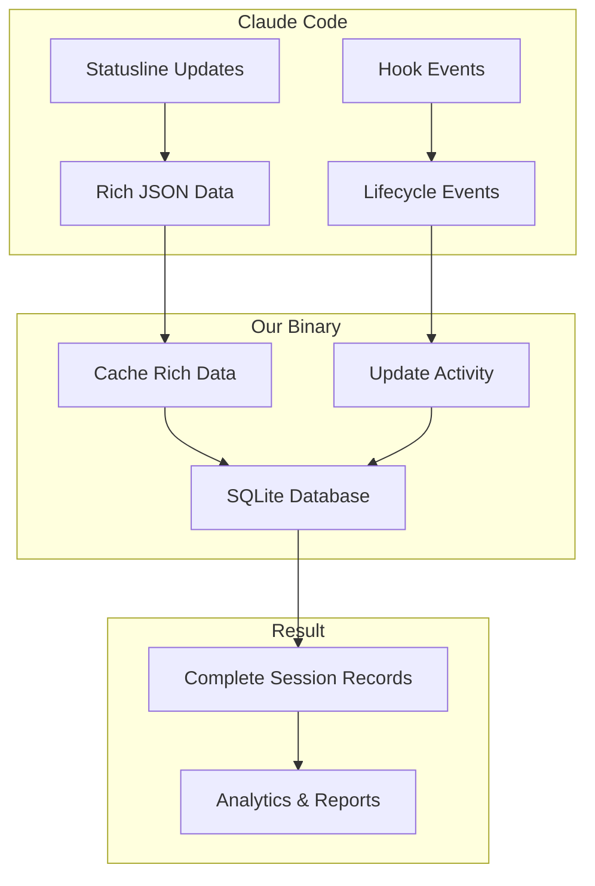

# Data Architecture Reference

**Hybrid statusline + hooks architecture** for comprehensive data
collection with zero performance impact on Claude Code operations.

## Hybrid Architecture Overview



**Key Innovation**: Statusline caches rich data, hooks provide precise
timing.

## Hybrid Data Collection Strategy

### Statusline Mode (Rich Data Source)

**Triggered**: Every 300ms by Claude Code **Data**: Complete session
metrics, cost tracking, model info **Purpose**: Cache comprehensive
session data to database

```json
{
	"session_id": "929efe36-d188-4175-86cc-8f162405f6a2",
	"model_id": "claude-sonnet-4-20250514",
	"model_display_name": "Sonnet 4",
	"total_cost_usd": 1.2686553,
	"total_lines_added": 43,
	"total_lines_removed": 8
}
```

### Hook Mode (Event-Driven Updates)

**Triggered**: By actual Claude Code lifecycle events **Data**: Basic
context (session_id, cwd, tool info) **Purpose**: Precise timing and
activity tracking

- **SessionStart/End** - Session lifecycle management
- **PreToolUse/PostToolUse** - Tool usage events and performance
- **UserPromptSubmit** - User interaction tracking

### CLI Integration

Our package binary will be called from hooks with operation flags:

```bash
# In .claude/settings.json
"command": "/path/to/our-binary --session-start"
"command": "/path/to/our-binary --tool-use"
```

## SQLite Database Schema

### Sessions Table

```sql
CREATE TABLE sessions (
  session_id TEXT PRIMARY KEY,
  project_path TEXT NOT NULL,
  transcript_path TEXT,
  model_id TEXT,
  model_display_name TEXT,
  total_cost_usd REAL DEFAULT 0,
  total_duration_ms INTEGER DEFAULT 0,
  total_lines_added INTEGER DEFAULT 0,
  total_lines_removed INTEGER DEFAULT 0,
  status TEXT DEFAULT 'active', -- active/completed
  created_at DATETIME DEFAULT CURRENT_TIMESTAMP,
  updated_at DATETIME DEFAULT CURRENT_TIMESTAMP
);
```

### Messages Table

```sql
CREATE TABLE messages (
  uuid TEXT PRIMARY KEY,
  session_id TEXT NOT NULL,
  parent_uuid TEXT,
  message_type TEXT NOT NULL, -- user/assistant
  content_text TEXT,
  tool_uses JSON,
  timestamp DATETIME,
  FOREIGN KEY(session_id) REFERENCES sessions(session_id)
);
```

### Tools Table

```sql
CREATE TABLE tools (
  id INTEGER PRIMARY KEY AUTOINCREMENT,
  session_id TEXT NOT NULL,
  message_uuid TEXT,
  tool_name TEXT NOT NULL,
  tool_input JSON,
  execution_time_ms INTEGER,
  timestamp DATETIME,
  FOREIGN KEY(session_id) REFERENCES sessions(session_id)
);
```

### File Positions Table

```sql
CREATE TABLE file_positions (
  file_path TEXT PRIMARY KEY,
  last_position INTEGER DEFAULT 0,
  last_size INTEGER DEFAULT 0,
  last_processed DATETIME DEFAULT CURRENT_TIMESTAMP
);
```

## Data Collection Workflows

### Hook-Driven Updates

1. **SessionStart** → INSERT new session record
2. **PreToolUse** → Log tool start, prepare for timing
3. **PostToolUse** → UPDATE session costs, INSERT tool record
4. **SessionEnd** → Mark session complete, final cost update

### Incremental JSONL Processing

1. Check `file_positions` for last processed position
2. Read only new lines from transcript files
3. Parse and INSERT new messages
4. UPDATE file position tracking

## Performance Benefits

### Hybrid Approach Advantages

- **Rich Data**: Full cost, model, and metrics from statusline
- **Zero Performance Impact**: Event-driven updates with no blocking
- **Precise Timing**: Hooks provide exact session lifecycle events
- **Battery Efficient**: No constant polling, only triggered updates
- **Complete Records**: Combines comprehensive data with accurate
  timing

### vs. Pure Statusline Polling

- **No constant database writes** - only updates on actual events
- **Lifecycle precision** - exact session start/end timestamps
- **Activity tracking** - hooks show real user interaction patterns

### vs. Hook-Only Approach

- **Rich session data** - model info, costs, metrics unavailable in
  hooks
- **Real-time metrics** - statusline provides live cost and line
  tracking
- **Visual consistency** - same data source for display and storage

## Statusline Integration

Statusline reads from SQLite cache instead of parsing raw data:

```sql
-- Real-time session status
SELECT total_cost_usd, total_lines_added, model_display_name
FROM sessions WHERE status = 'active' LIMIT 1;

-- Project totals
SELECT SUM(total_cost_usd) as project_cost
FROM sessions WHERE project_path = ?;
```

This architecture provides efficient, scalable data processing that
respects system resources while enabling powerful analytics
capabilities.
