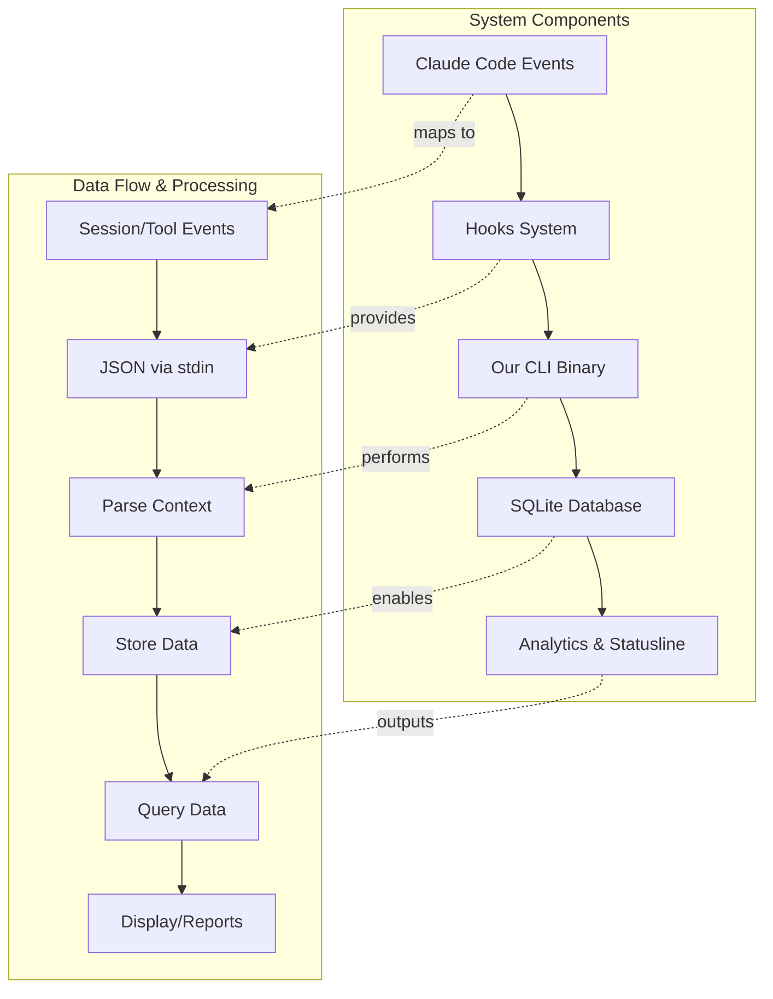

# Data Architecture Reference

Event-driven data collection using Claude Code hooks with SQLite
storage for efficient analytics and real-time statusline updates.

## Architecture Overview



## Hook Integration Strategy

### Hook Types We'll Use

- **SessionStart/End** - Session lifecycle tracking
- **PreToolUse/PostToolUse** - Tool usage and cost tracking
- **UserPromptSubmit** - Activity and engagement metrics

### Available Hook Context

Hooks receive JSON via stdin with:

- `session_id`, `transcript_path`, `cwd`
- `tool_name`, `tool_input` (for tool events)
- `prompt` (for user prompt events)
- Environment: `CLAUDE_PROJECT_DIR`

### CLI Integration

Our package binary will be called from hooks with operation flags:

```bash
# In .claude/settings.json
"command": "/path/to/our-binary --session-start"
"command": "/path/to/our-binary --tool-use"
```

## SQLite Database Schema

### Sessions Table

```sql
CREATE TABLE sessions (
  session_id TEXT PRIMARY KEY,
  project_path TEXT NOT NULL,
  transcript_path TEXT,
  model_id TEXT,
  model_display_name TEXT,
  total_cost_usd REAL DEFAULT 0,
  total_duration_ms INTEGER DEFAULT 0,
  total_lines_added INTEGER DEFAULT 0,
  total_lines_removed INTEGER DEFAULT 0,
  status TEXT DEFAULT 'active', -- active/completed
  created_at DATETIME DEFAULT CURRENT_TIMESTAMP,
  updated_at DATETIME DEFAULT CURRENT_TIMESTAMP
);
```

### Messages Table

```sql
CREATE TABLE messages (
  uuid TEXT PRIMARY KEY,
  session_id TEXT NOT NULL,
  parent_uuid TEXT,
  message_type TEXT NOT NULL, -- user/assistant
  content_text TEXT,
  tool_uses JSON,
  timestamp DATETIME,
  FOREIGN KEY(session_id) REFERENCES sessions(session_id)
);
```

### Tools Table

```sql
CREATE TABLE tools (
  id INTEGER PRIMARY KEY AUTOINCREMENT,
  session_id TEXT NOT NULL,
  message_uuid TEXT,
  tool_name TEXT NOT NULL,
  tool_input JSON,
  execution_time_ms INTEGER,
  timestamp DATETIME,
  FOREIGN KEY(session_id) REFERENCES sessions(session_id)
);
```

### File Positions Table

```sql
CREATE TABLE file_positions (
  file_path TEXT PRIMARY KEY,
  last_position INTEGER DEFAULT 0,
  last_size INTEGER DEFAULT 0,
  last_processed DATETIME DEFAULT CURRENT_TIMESTAMP
);
```

## Data Collection Workflows

### Hook-Driven Updates

1. **SessionStart** → INSERT new session record
2. **PreToolUse** → Log tool start, prepare for timing
3. **PostToolUse** → UPDATE session costs, INSERT tool record
4. **SessionEnd** → Mark session complete, final cost update

### Incremental JSONL Processing

1. Check `file_positions` for last processed position
2. Read only new lines from transcript files
3. Parse and INSERT new messages
4. UPDATE file position tracking

## Performance Benefits

### vs. 300ms Polling

- **99.9% less resource usage** - only runs on actual events
- **No memory accumulation** - triggered processing, not continuous
- **Battery efficient** - no constant background polling

### vs. Full File Parsing

- **Incremental processing** - only new data parsed
- **Position tracking** - resume from interruptions
- **SQLite indexing** - instant aggregation queries
- **Cross-project analytics** - unified data model

## Statusline Integration

Statusline reads from SQLite cache instead of parsing raw data:

```sql
-- Real-time session status
SELECT total_cost_usd, total_lines_added, model_display_name
FROM sessions WHERE status = 'active' LIMIT 1;

-- Project totals
SELECT SUM(total_cost_usd) as project_cost
FROM sessions WHERE project_path = ?;
```

This architecture provides efficient, scalable data processing that
respects system resources while enabling powerful analytics
capabilities.
